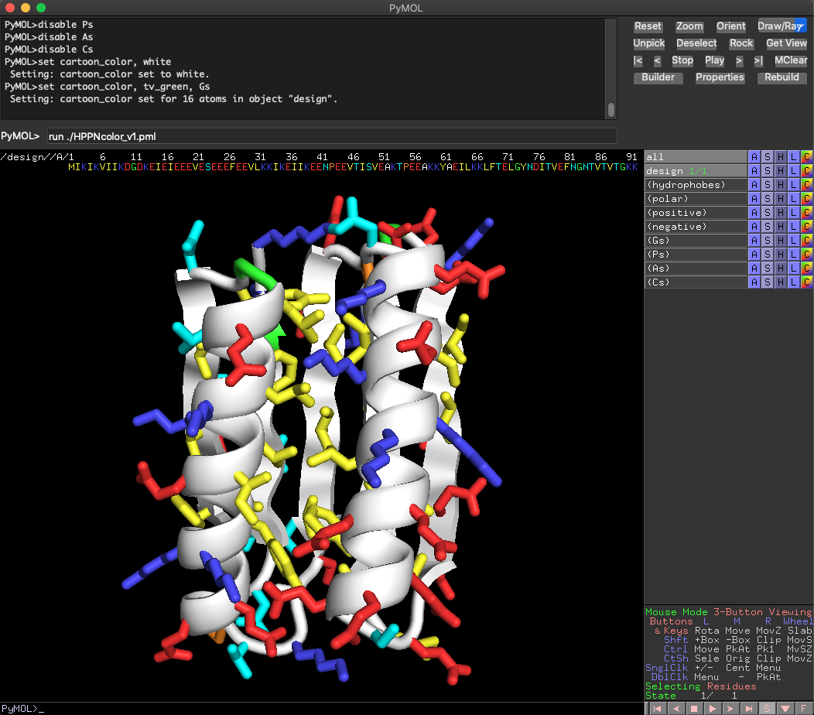
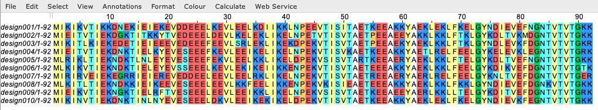

# HPPNcolor

"HPPNcolor_v1.pml" is a PyMOL script that colors residues based on <ins>H</ins>ydrophobicity/<ins>P</ins>olarity, <ins>P</ins>ositive/<ins>N</ins>egative charge, and residues　(Pro, Gly) with unique main-chain dihedral angles. It colors 20 different amino acid residues as shown below.

Yellow: Val, Ile, Leu, Phe, Tyr, Trp, Met

Cyan: Asn, Gln, Ser, Thr

Blue: His, Lys, Arg

Red: Asp, Glu

Green: Gly Cartoon

Orange: Pro

White: Cartoon and Ala

Yellow-green (lime): Cys

This coloring is used to visualize the presence of exposed hydrophobic and buried hydrophilic residues, the position of Gly and Pro, and the distribution of positive and negative charged residues.

## Usage
```
# PyMOL command line
PyMOL> run /path/to/HPPNcolor_v1.pml

# Manual 
menubar "File" ---> "Run Script..." ---> Select "HPPNcolor_v1.pml" ---> "Open"
```

Since the backbone of cartoon representation is forced to be white, if you want to change the color, please use the following command to unset "cartoon_color".
```
# PyMOL command line
PyMOL> unset cartoon_color
PyMOL> unset cartoon_color, (all)
```

You can add the `hppn` command to PyMOL by executing “hppn.py”.
```
# PyMOL command line
PyMOL> run /path/to/hppn.py
PyMOL> hppn
```

“HPPNcoloring.jc” is a color scheme file for JalView ( https://www.jalview.org/ ). It can be used to color sequence alignments based on the HPPNcolor.
```
# JalView software 
JalView menu bar ---> Colour ---> User defined... ---> Load scheme　---> Select "HPPNcoloring.jc" ---> "Open"
```

<p align="center">
  <br><br>
  
</p>
